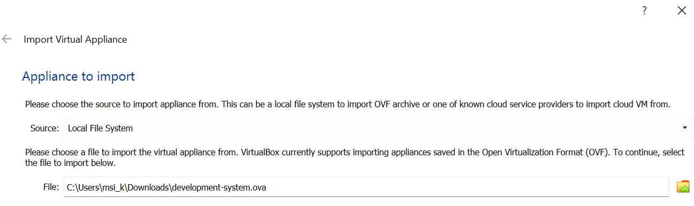
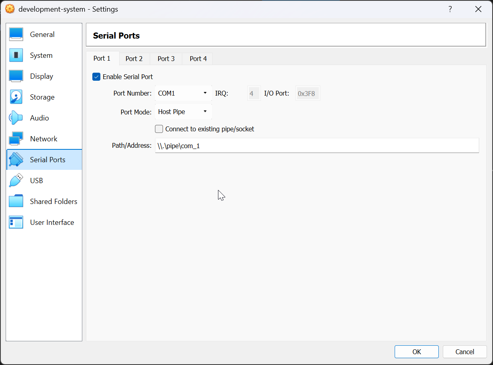
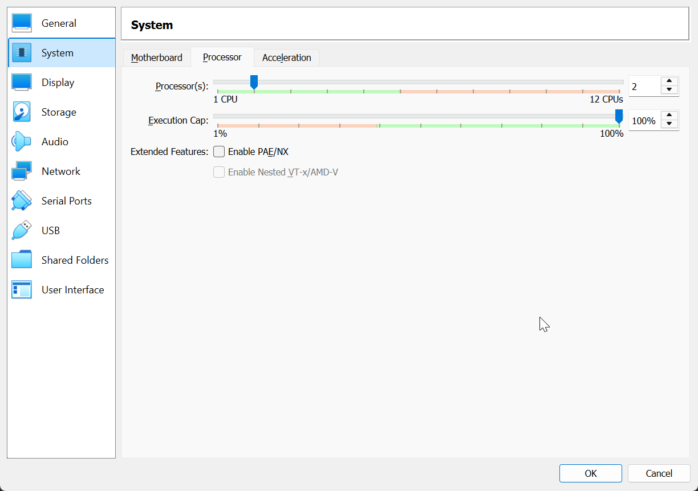
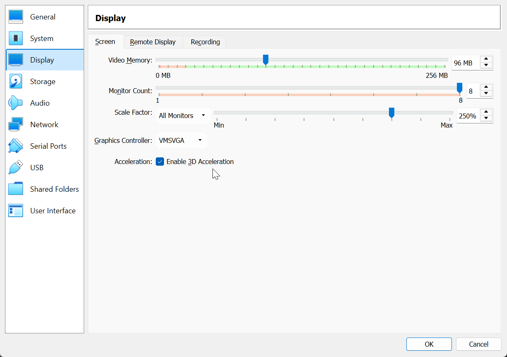
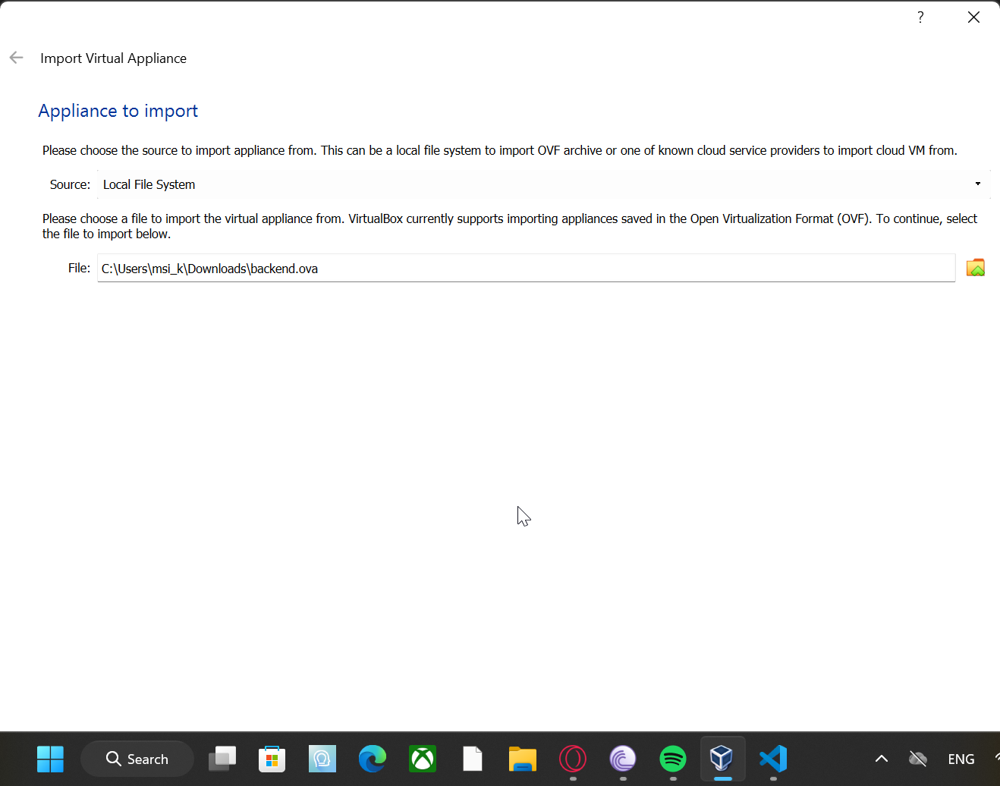
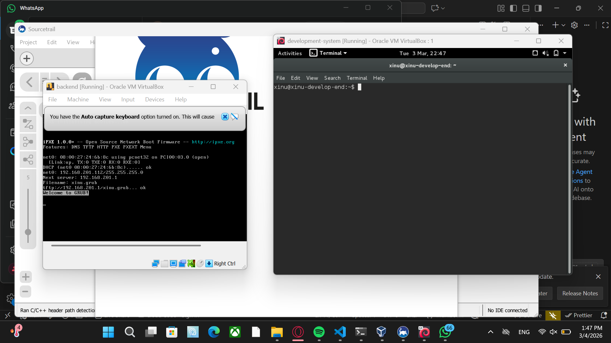

# <h1 align ="center"> Laporan Praktikum Modul 01

 Andika Rifki Pratama - 2311104011

## Dasar Teori

Xinu OS merupakan sistem operasi yang dibuat khusus untuk keperluan riset dan pembelajaran. Xinu sendiri digunakan untuk mempelajari konsep dasar sistem operasi seperti manajemen proses, memori, dan scheduling CPU.

Oracle VirtualBox merupakan salah satu software virtualisasi sistem operasi yang memastikan pengguna dapat menjalankan sistem operasi lain pada sistem operasi yang sedang berjalan sekarang.

## Guided
Langkah pertama yang dilakukan adalah melakukan import file development system kedalam VM

Setelah file selesai diimpor, lanjutkan dengan setting langkahnya adalah, <b>Settings > Serial Ports > Ports 1 > Path Address ganti menjadi \.\pipe\com_1 </b>

Kemudian masuk ke <b> System > Processor > Ubah jumlah processor dari 1 ke 2 > </b>

Setelahnya Masuk ke <b> Display > Acceleration > Pastikan Enable 3D Acceleration enabled.</b>

Kemudian lanjutkan dengan mengimpor file backend ke dalam VM dengan cara yang sama seperti file sebelumnya

Lanjutkan kembali dengan melakukan setting Serial Ports dengan cara <b>Settings > Serial Ports > Ports 1 > Path Address ganti menjadi \.\pipe\com_1 </b>

Selesai!

