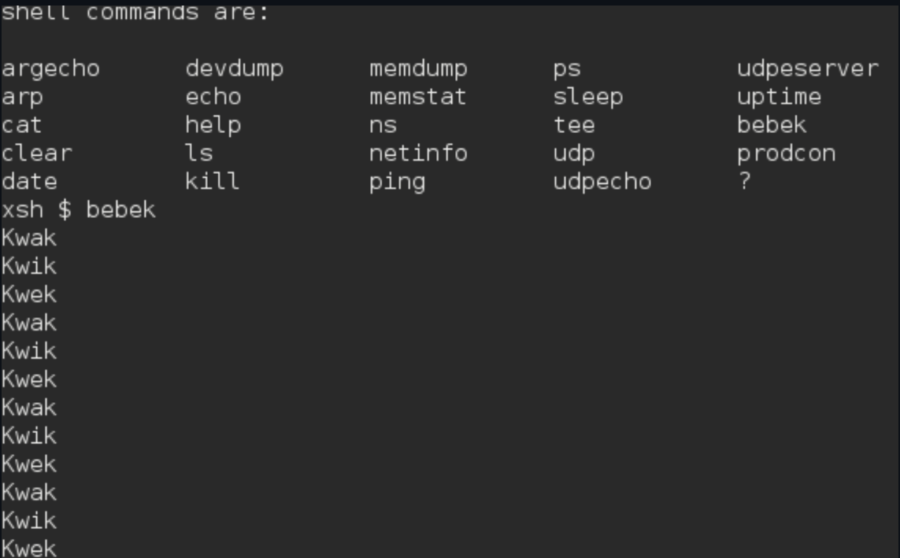
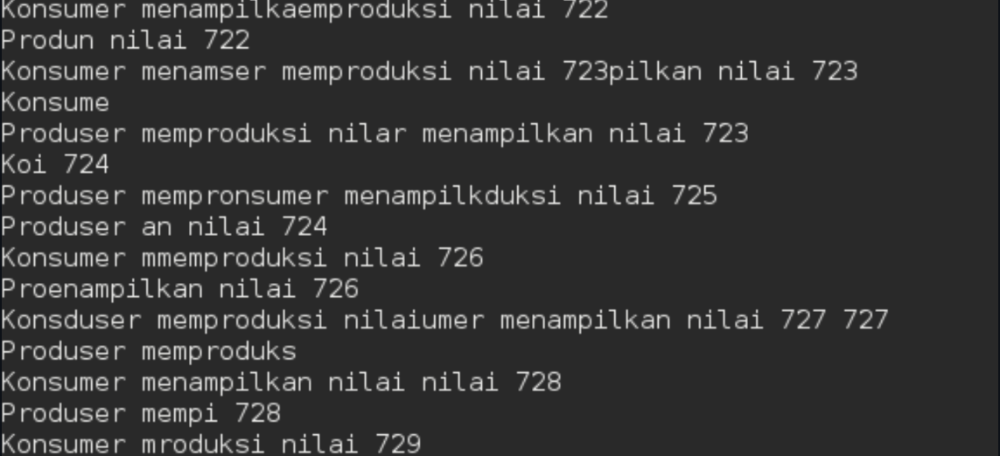

# <h1 align ="center"> Laporan Praktikum Modul 01

 Andika Rifki Pratama - 2311104011

## Dasar Teori

# Semaphore & Mutex — Sistem Operasi Xinu

## Definisi
Semaphore adalah variabel abstrak untuk **mengontrol akses** beberapa proses ke sumber daya bersama. Diperkenalkan oleh **Edsger Dijkstra**. Nilainya berupa integer yang menunjukkan ketersediaan sumber daya.

## Operasi Utama di Xinu

| Operasi | Fungsi |
|---|---|
| `semcreate(n)` | Inisiasi semaphore dengan nilai awal `n` |
| `wait(sem)` | Decrement — blokir proses jika nilai jadi negatif |
| `signal(sem)` | Increment — bebaskan proses yang menunggu |

## Wait & Signal

- **Wait (P):** Turunkan nilai semaphore. Jika nilai = 0, proses **blocked** sampai ada yang signal.
- **Signal (V):** Naikkan nilai semaphore. Proses yang blocked **boleh lanjut**.

## Guided
Langkah pertama yang dilakukan adalah melakukan import file development system kedalam VM

