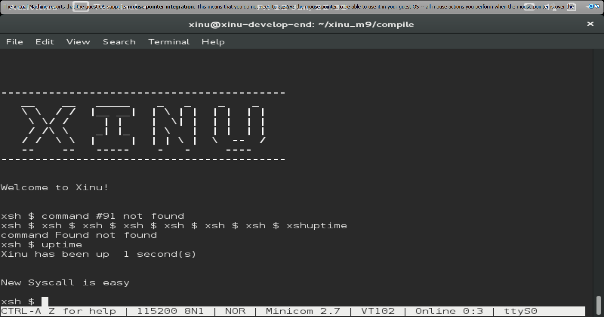
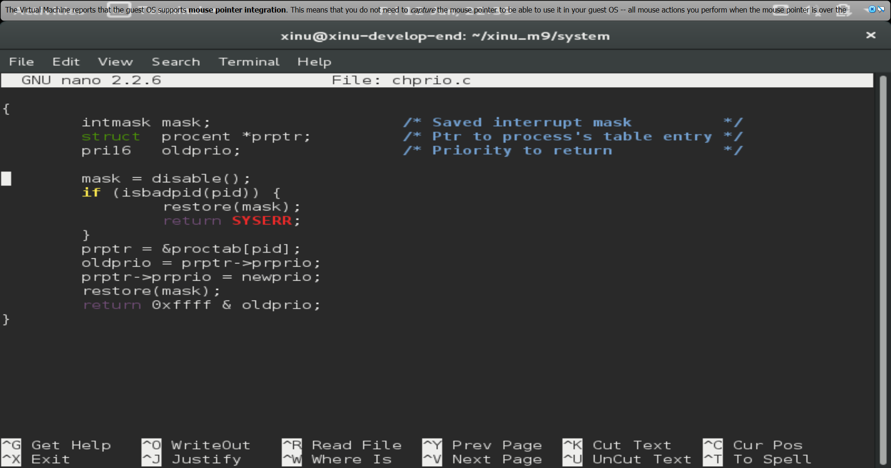
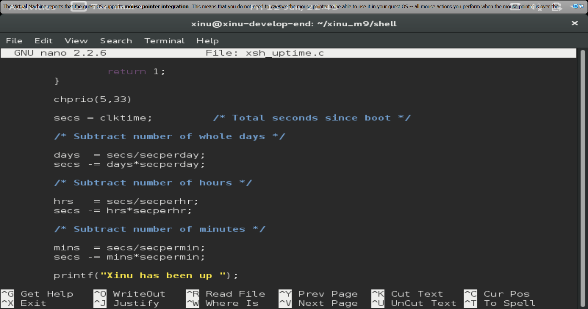
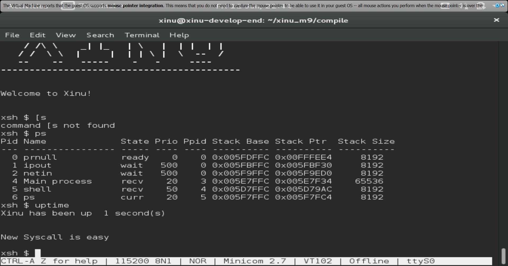
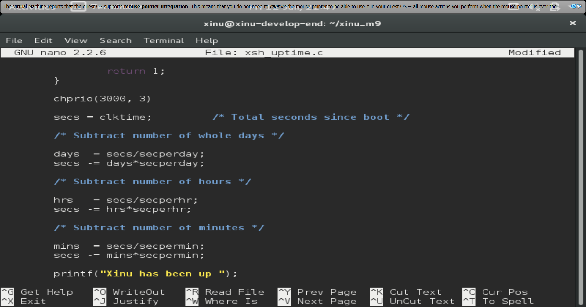

# <h1 align ="center"> Laporan Praktikum Modul 09

 Andika Rifki Pratama - 2311104011

## Dasar Teori

# Syscall

Syscall adalah cara program minta tolong ke kernel OS, karena program nggak bisa langsung akses hardware semua harus lewat syscall sebagai perantara, mulai dari ngurus proses (fork, exit), file (read, write), memory (mmap), sampai network (socket) — dan di Xinu, fungsi kayak semcreate(), wait(), signal() juga masuk kategori ini.

## Guided
1. [50 Poin] Buat syscall baru seperti yang ditunjukkan pada modul syscall poin 9.5! (sertakan Screenshot kode dan hasil run)

2. [25 Poin] Perbaiki syscall chprio (xinu/system/chprio.c) dengan memperhatikan validasi input 
Pastikan id adalah angka dari 0 – NPROC (ukuran maks banyaknya proses)
Pastikan prioritas adalah bilangan yang positif

3. Lakukan hal-hal berikut ini
Edit xsh_uptime.c
Tambahkan kode berikut
Compile source code tersebut dengan perintah
make clean
make
Jalankan perintah ps
xsh $ ps

perhatikan prioritas proses dengan id = 5 
Jalankan uptime 
xsh $ uptime
Perhatikan hasil perintah tersebut
Jalankan ps
xsh $ ps

perhatikan prioritas proses dengan id = 5 seharusnya sudah berubah
[25 Poin] Testing chprio syscall yang telah diubah
Testing prioritas tidak boleh < 0: Ubah “chprio(5,33)” menjadi “chprio(5,-3)” pada xsh_uptime.c
Testing id adalah valid: Ubah “chprio(5,33)” menjadi “chprio(3000,3)”
Hasil dua testing di atas adalah prioritas tidak berubah karena salah argument (dibuktikan dengan menggunakan perintah ps)

