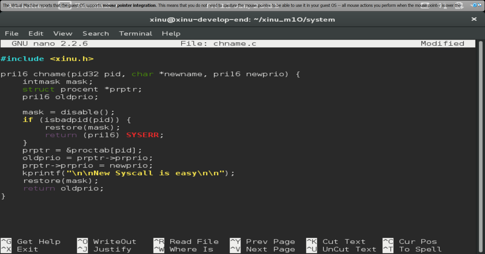
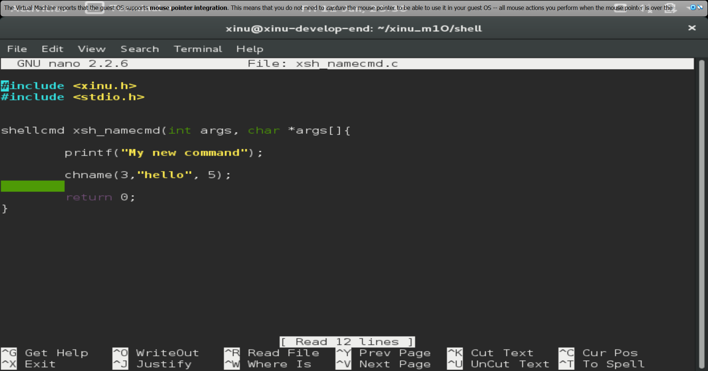

# <h1 align ="center"> Laporan Praktikum Modul 010

 Andika Rifki Pratama - 2311104011

## Dasar Teori

# Shell

Shell adalah program perantara antara user dan kernel.
Terdapat dua jenis shell, yakni CLI seperti Bash dan Zsh yang berbasis teks, serta GUI seperti File Manager yang berbasis grafis. Pada lingkungan Linux maupun Xinu, shell yang digunakan umumnya berupa CLI.
Shell juga bertanggung jawab menangani fitur seperti redirection (>), piping (|), serta manajemen proses di background, sehingga menjadikannya komponen penting dalam interaksi pengguna dengan sistem operasi.

## Guided
1. [40 Poin] Akan dimodifikasi shell dengan modifikasi syscall bernama chname yang berfungsi untuk mengubah nama suatu proses. Lihat kembali modul sebelumnya cara membuat syscall. 

Perhatikan sekarang syscall chname mempunyai 3 parameter yaitu pid, character dan panjang character. Character untuk menyimpan nama dan panjang character untuk panjang nama.
Pada prototypes.h chname diubah menjadi:
Pada chname.c fungsi diubah dari:
Modifikasi kode pada chname.c sehingga nama proses bisa diubah bila syscall tersebut dipanggil.

2. [40 Poin] Buatlah perintah baru bernama namecmd sesuai dengan langkah-langkah pada no.5 pada modul shell!
Berikut adalah kode dalam perintah baru namecmd:

3. [20 Poin] Test hasilnya: 
Masuk ke terminal xinu
Jalankan perintah ps
Jalankan perintah namecmd
Jalankan perintah ps
Lihat nama proses telah berubah

