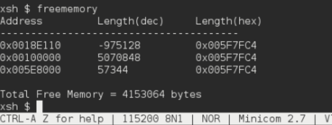

# <h1 align ="center"> Laporan Praktikum Modul 011

 Andika Rifki Pratama - 2311104011

## Dasar Teori
Manajemen memori pada sistem operasi bertugas mengatur, mengalokasikan, dan melacak penggunaan RAM selama sistem berjalan. Pada Embedded Xinu, layout memori dibagi menjadi beberapa segmen utama: text segment untuk kode instruksi, data segment untuk variabel global yang sudah terinisialisasi, BSS segment untuk variabel global yang belum terinisialisasi, serta area dinamis berupa stack dan heap.

Xinu mengelola memori bebas pada area heap menggunakan struktur Free Memory List, yakni sebuah linked list yang menyimpan blok-blok memori yang tersedia. Saat proses meminta alokasi memori melalui getmem(), kernel menelusuri linked list tersebut untuk menemukan blok yang mencukupi. Sebaliknya, ketika memori dilepas melalui freemem(), blok dikembalikan dan digabungkan kembali ke dalam list. Pemahaman terhadap mekanisme ini penting untuk mencegah memory leak dan fragmentasi pada sistem benam.

# Memori Xinu

Shell adalah program perantara antara user dan kernel.
Terdapat dua jenis shell, yakni CLI seperti Bash dan Zsh yang berbasis teks, serta GUI seperti File Manager yang berbasis grafis. Pada lingkungan Linux maupun Xinu, shell yang digunakan umumnya berupa CLI.
Shell juga bertanggung jawab menangani fitur seperti redirection (>), piping (|), serta manajemen proses di background, sehingga menjadikannya komponen penting dalam interaksi pengguna dengan sistem operasi.

## Guided
1. [80 poin] Buatlah perintah baru bernama freememory yang memiliki dua fungsi berikut:
[40 poin] Menampilkan seluruh free memory block yang tercatat dalam free memory list pada Xinu.
[40 poin] Menghitung dan menampilkan total ukuran free memory berdasarkan seluruh block yang ada pada list tersebut.

2. [4 poin per subsoal] Jawablah pertanyaan berikut:
- Mengapa Xinu memisahkan data segment dan BSS segment?
   Karena variabel yang sudah terinisialisasi perlu disimpan nilainya di binary/executable, sedangkan variabel yang belum terinisialisasi tidak perlu,cukup dicatat ukurannya lalu di-nol-kan saat runtime. Pemisahan ini menghemat ukuran file executable.
- Bagaimana alokasi dan dealokasi memori selama eksekusi memengaruhi ukuran free space?
    Setiap getmem() memperkecil free space, setiap freemem() memperbesar. Masalahnya, jika alokasi dan dealokasi tidak teratur, free space bisa terfragmentasi menjadi blok-blok kecil yang tidak bisa dipakai meski total ukurannya cukup.
- Mengapa penggunaan heap lebih berpotensi menimbulkan masalah dibandingkan stack?
    Stack dikelola otomatis oleh sistem (LIFO, rapi). Heap dikelola manual oleh programmer — kalau lupa freemem(), terjadi memory leak. Kalau alokasi tidak teratur, terjadi fragmentasi. Tidak ada mekanisme otomatis yang membersihkannya.
- Mengapa Xinu menggunakan struktur linked list untuk menyimpan free block?
    Karena ukuran dan jumlah blok bebas bersifat dinamis dan tidak bisa diprediksi. Linked list memungkinkan penambahan dan penggabungan blok secara fleksibel tanpa membutuhkan alokasi memori tambahan yang tetap.
- Apa tantangan utama dalam penggunaan heap di Xinu?
    Dua tantangan utamanya adalah fragmentasi,blok bebas terpecah-pecah sehingga sulit menemukan blok besar yang cukup — dan memory leak akibat proses yang tidak melepas memori setelah selesai digunakan.